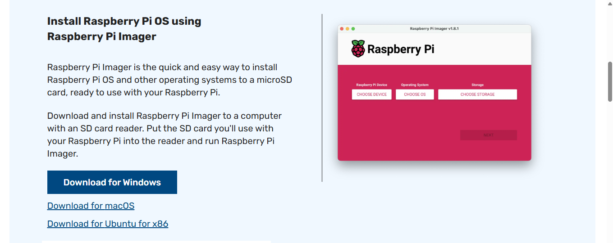

# 🚀 Raspberry Pi 3B - Arranque desde HDD o SSD

Este repositorio documenta los pasos que seguí para configurar una **Raspberry Pi 3B** y lograr que arranque (**bootee**) desde un disco externo **HDD o SSD**.  
> ⚠️ **Nota:** La forma de habilitar el arranque por USB varía según el modelo de Raspberry Pi. Esta guía es específica para **Raspberry Pi 3B**.

---

## 📑 Tabla de contenido

1. [Requisitos](#requisitos)
2. [Descargar Raspberry Pi OS](#descargar-raspberry-pi-os)
3. [Grabar Raspberry Pi OS en la microSD](#grabar-raspberry-pi-os-en-la-microsd)
4. [Preparar el disco externo](#preparar-el-disco-externo)
5. [Habilitar arranque por USB](#habilitar-arranque-por-usb)
6. [Clonar la microSD al disco externo](#clonar-la-microsd-al-disco-externo)
7. [Notas y recomendaciones](#notas-y-recomendaciones)

---

## Requisitos

- **Raspberry Pi 3B**
- **Tarjeta microSD** de al menos **16 GB**
- **Disco externo HDD o SSD**
- **Fuente de alimentación estable** (se recomienda un hub USB alimentado para el disco externo)
- PC con **Raspberry Pi Imager** instalado

---

## Descargar Raspberry Pi OS

Descargo el **Raspberry Pi Imager** desde la web oficial:  
👉 [https://www.raspberrypi.com/software/](https://www.raspberrypi.com/software/)  

En mi caso, descargo la versión para **Windows**.  
<p align="center">
  
</p>


---

## Grabar Raspberry Pi OS en la microSD

1. Inserto la **microSD de 16 GB** en la PC.
2. Abro **Raspberry Pi Imager** y selecciono:  
   - **Modelo**: Raspberry Pi 3B  
   - **Sistema operativo**: Raspberry Pi OS (recomendado)  
   - **Destino**: microSD  
3. Inicio la instalación. Si se solicitan configuraciones avanzadas, las dejo en blanco o acepto la configuración por defecto.
4. Una vez finalizada la grabación, retiro la microSD y la coloco en la Raspberry Pi.

---

## Habilitar arranque por USB

1. Arranco la Raspberry Pi usando la microSD.
2. Actualizo el sistema:
   ```bash
   sudo apt update && sudo apt full-upgrade -y
