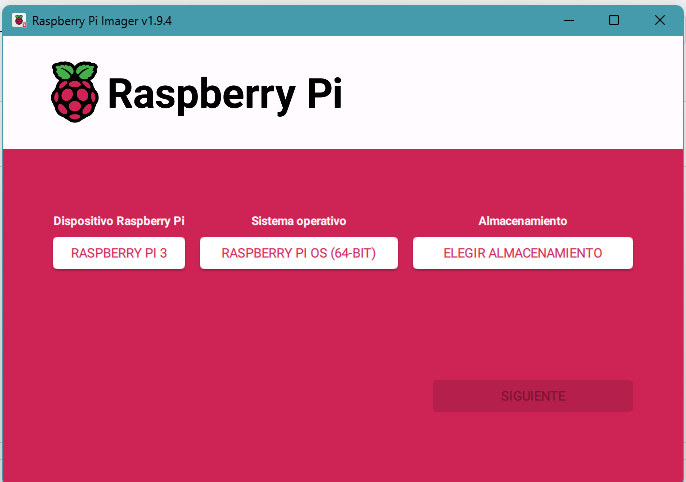

# 🚀 Raspberry Pi 3B - Arranque desde HDD o SSD

Este repositorio documenta los pasos que seguí para configurar una **Raspberry Pi 3B** y lograr que arranque (**bootee**) desde un disco externo **HDD o SSD**.  
> ⚠️ **Nota:** La forma de habilitar el arranque por USB varía según el modelo de Raspberry Pi. Esta guía es específica para **Raspberry Pi 3B**.

---

## 📑 Tabla de contenido

1. [Verificar si tu modelo es Raspberry Pi 3B](#verificar-si-tu-modelo-es-raspberry-pi-3b)
2. [Requisitos](#requisitos)
3. [Descargar Raspberry Pi OS](#descargar-raspberry-pi-os)
4. [Grabar Raspberry Pi OS en la microSD](#grabar-raspberry-pi-os-en-la-microsd)
5. [Habilitar arranque por USB](#habilitar-arranque-por-usb)
6. [Clonar la microSD al disco externo](#clonar-la-microsd-al-disco-externo)
7. [Notas y recomendaciones](#notas-y-recomendaciones)

---

## Verificar si tu modelo es Raspberry Pi 3B

Abrí una terminal en tu Raspberry Pi y ejecutá:

```bash
cat /proc/cpuinfo | grep Revision
```
Según el código que devuelve la línea Revision, podés identificar tu modelo:
| Revisión | Modelo                                          |
| -------- | ----------------------------------------------- |
| `a02082` | Raspberry Pi 3B                                 |
| `a22082` | Raspberry Pi 3B                                 |
| `a020d3` | Raspberry Pi 3B+                                |
| otros    | Ver lista oficial de revisiones de Raspberry Pi |

✅ Este método es compatible con Raspberry Pi 3B (no 3B+).

---
## Requisitos

- **Raspberry Pi 3B**
- **Tarjeta microSD** de al menos **16 GB**
- **Disco externo HDD o SSD**
- **Fuente de alimentación estable** (se recomienda un hub USB alimentado para el disco externo)
- PC con **Raspberry Pi Imager** instalado

---

## Descargar Raspberry Pi OS

Descargo el **Raspberry Pi Imager** desde la web oficial:  
👉 [https://www.raspberrypi.com/software/](https://www.raspberrypi.com/software/)  

En mi caso, descargo la versión para **Windows**.  
<p align="center">
  
</p>


---

## Grabar Raspberry Pi OS en la microSD

1. Inserto la **microSD de 16 GB** en la PC.
2. Abro **Raspberry Pi Imager** y selecciono:  
   - **Modelo**: Raspberry Pi 3B  
   - **Sistema operativo**: Raspberry Pi OS (recomendado)  
   - **Destino**: microSD  
3. Inicio la instalación. Si se solicitan configuraciones avanzadas, las dejo en blanco o acepto la configuración por defecto.
4. Una vez finalizada la grabación, retiro la microSD y la coloco en la Raspberry Pi.

<p align="center">
  
</p>


---

## Habilitar arranque por USB

1. Arranca la Raspberry Pi usando la microSD.
2. Abre una terminal.
3. Antes de actualizar, verifique el espacio en disco de su dispositivo. Ejecute el siguiente comando:
    ```bash
    df -h
  👉 Esto te muestra el espacio libre para asegurarte de que hay suficiente para actualizar.
  
4. Actualiza la lista de paquetes:
   ```bash
   sudo apt update
5. Actualiza todos los paquetes del sistema:
   ```bash
    sudo apt full-upgrade
  📌 Nota: El comando te mostrará cuánto espacio se necesita. Pulsa "y" cuando lo solicite para aceptar y continuar.
  
6. Espera a que finalice la actualización.
7. Una vez completada, reinicie el dispositivo.
    ```bash
    sudo reboot
8. Verifica que el arranque por USB esté habilitado:
    ```bash
    vcgencmd otp_dump | grep 17:
    ```

    Si devuelve:
    ```text
    17:3020000a
    ```

    Significa que el USB boot mode ya está habilitado.

9. Si no está habilitado, actívalo agregando esta línea al archivo config.txt:
    ```bash
    echo program_usb_boot_mode=1 | sudo tee -a /boot/config.txt

10. Reinicia la Raspberry Pi:
    ```bash
    sudo reboot

11. Verifica nuevamente:
    ```bash
    vcgencmd otp_dump | grep 17:
    ```
    
    Si devuelve:
    ```text
    17:3020000a
    ```
    
    Significa que el USB boot mode ya está habilitado.


